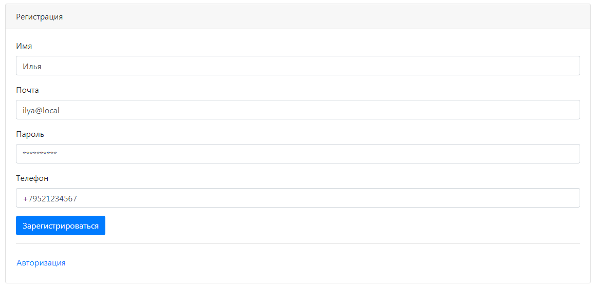
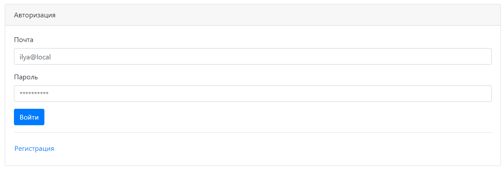
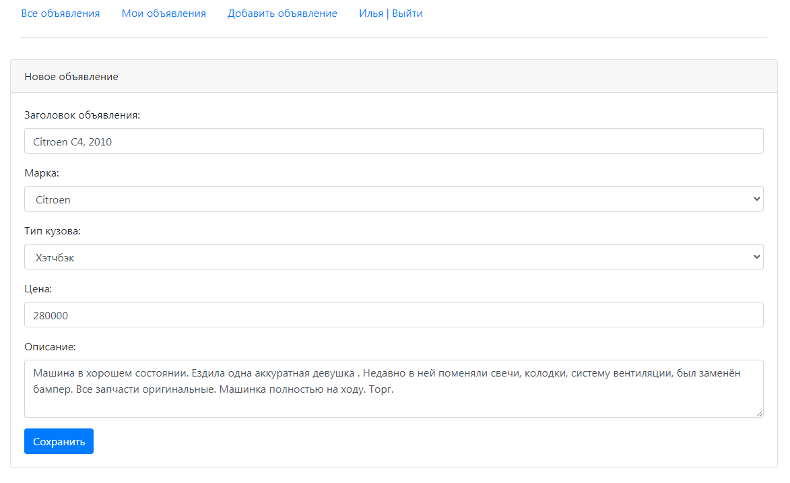
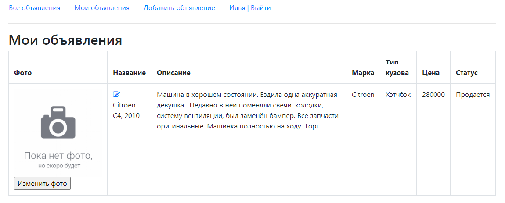
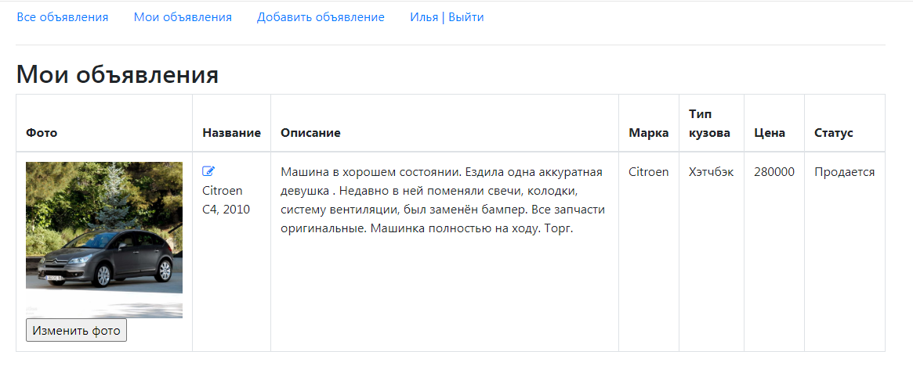
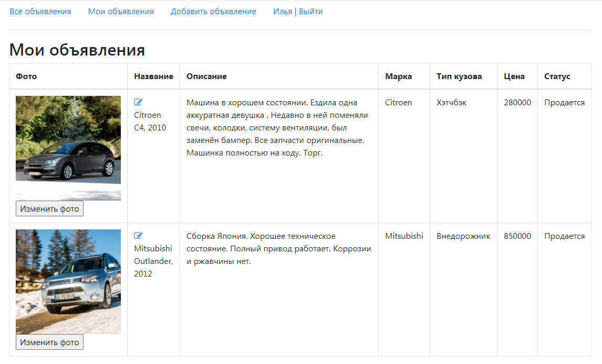
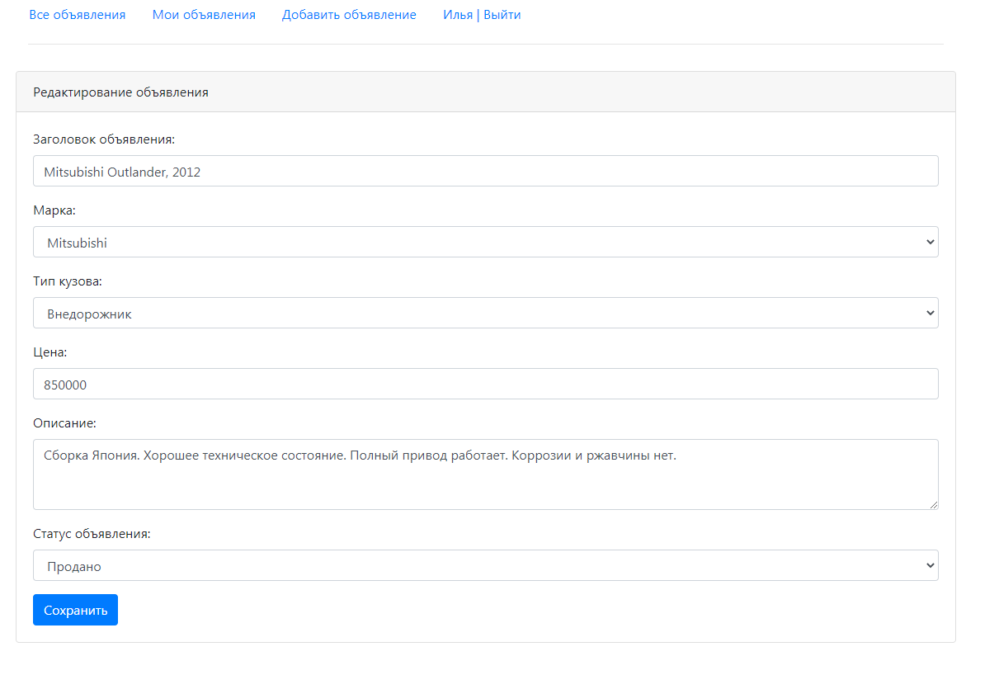
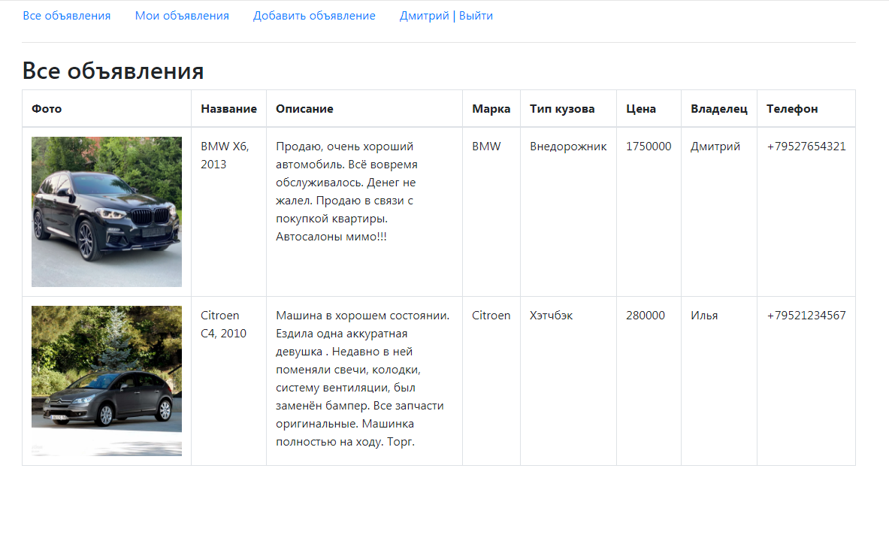

Проект "Площадка по продажам автомобилей"
=========================================

Проект для изучения Java EE.

Данное приложение - сайт для продажи автомобилей.

Используемые технологии:
* Java 12
* Java EE Servlets
* Tomcat
* PostgresSQL, Hibernate
* Maven
* HTML, JavaScript, Bootstrap, JSON

На сайте должны быть объявления. В объявлении должно быть: описание, марка машины, тип кузова, фото.
Объявление имеет статус продано или нет.
Должны существовать пользователи. Автор объявления.

Регистрация пользователя

Авторизация пользователя

Добавление объявления

Список объявлений пользователя после добавления нового объявления

Редактирование объявления. Смена фотографии автомобиля

Все объявления пользователя

Редактирование объявления. Смена статуса объявления.

Все активные объявления пользователей

